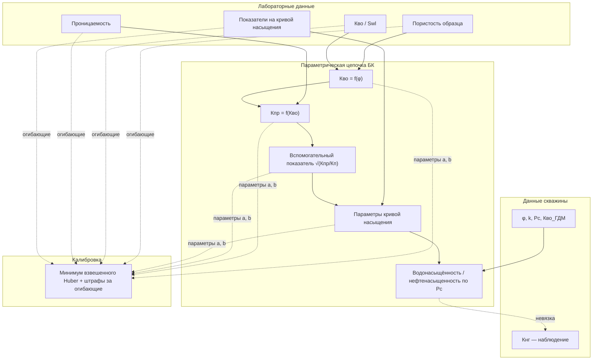

# Глава 1. Капиллярные модели, методы оценки насыщенности и постановка задачи калибровки

**План главы.** В параграфе **1.1** рассматриваются физические предпосылки капиллярного равновесия и роль капиллярного давления при описании насыщенности. В **1.2** излагается подход на основе J-функции Леверетта как параметрического моста между капиллярным давлением и условиями среды. В **1.3** описывается методологическая линия Брукса — Кори в виде цепочки лабораторно-параметрических зависимостей; обобщённая структура расчёта и связи с данными иллюстрируются **рисунком 1.1**. В **1.4** формулируется связь «модель — наблюдаемая величина» на примере нефтенасыщенности и данных скважин. В **1.5** даётся постановка задачи калибровки как обратной задачи при ограничениях и критериях качества. Для единообразия изложения в главе используются **обозначения и термины, сведённые в таблице 1.1**. В **выводах** фиксируются положения, на которых строятся методика и программная реализация во второй и третьей главах.

---

## Таблица 1.1 — Основные обозначения и термины

**Таблица 1.1** — Основные обозначения и термины

| Обозначение / термин | Смысл в работе |
|----------------------|----------------|
| \(S_w\), Кво | Водонасыщённость; в данных скважины — величина, согласованная с колонкой SWL_GDM после нормализации |
| \(S_o\), \(K_{нг}\) | Нефтенасыщенность; в данных — показатель, согласованный с колонкой «Кнг» (историческое / модельное) |
| \(P_c\) | Капиллярное давление (входной атрибут скважинных данных) |
| \(\varphi\), \(k\) | Пористость и проницаемость (по данным ГДМ / геомодели) |
| J-функция Леверетта | Безразмерная характеристика капиллярного давления; в работе — параметрическая модель \(J \approx a \cdot S_{wn}^{b}\) для сопоставления с лабораторным облаком |
| Модель Брукса — Кори | В работе — **цепочка** зависимостей: Кво(пористость) → Кпр(Кво) → параметры на кривой насыщения; параметры \((a,b)\) по четырём звеньям |
| Огибающие | Верхняя и нижняя границы коридора по лабораторным точкам для каждого звена цепочки |
| Калибровка | Подбор численных параметров модели по минимуму целевого функционала при ограничениях |
| Вес точки | Коэффициент значимости наблюдения при суммировании невязки (в т.ч. учёт перфорации и добычи, если заданы) |
| Невязка | Разность «модель − наблюдение» по нефтенасыщенности (или эквивалентному показателю) в допустимых точках |

*Примечание.* При необходимости полный перечень входных полей файлов выносится в приложение; таблица 1.1 задаёт минимальный терминологический каркас главы 1.

---

## 1.1. Капиллярное равновесие, капиллярное давление и насыщенность

Многофазное течение в пористой среде сопровождается распределением фаз по объёму порового пространства, которое в значительной степени определяется **капиллярными эффектами** на межфазных границах. В практике нефтегазового дела насыщенность водой и нефтью в зоне перехода между нефтеносным и водоносным комплексами и в зонах неравновесного заводнения часто интерпретируется с опорой на **капиллярное давление** \(P_c\) как функцию насыщенности и свойств породы (см. обозначения в **таблице 1.1**).

С позиции постановки задачи калибровки важно разделить два уровня: **(а)** физико-геологическое описание, задающее структуру связи «свойства среды — капиллярное давление — насыщенность»; **(б)** параметрическая модель, в которой неизвестными выступают коэффициенты, подбираемые по данным. Далее под «капиллярной моделью» понимается параметризованное соотношение, позволяющее по измеренным или заданным величинам восстановить водонасыщённость и при принятом допущении о двухфазной системе нефть–вода — **нефтенасыщенность** \(K_{нг}\) как выходную характеристику.

---

## 1.2. J-функция Леверетта как параметрическая модель согласования капиллярных данных

J-функция Леверетта традиционно вводится как безразмерная группа, связывающая капиллярное давление с межфазным натяжением, проницаемостью и пористостью. В прикладных постановках для инженерных расчётов и калибровки по данным скважин J-функция часто используется в **степенной параметризации** относительно нормированной водонасыщённости \(S_{wn}\), что задаёт компактный набор коэффициентов \(a\), \(b\) и обеспечивает гладкость зависимости в области допустимых значений насыщенности.

С методологической точки зрения для настоящей работы важны следующие свойства такого подхода: **низкая размерность** параметров при сохранении нелинейности модели; **прямая связь** с наблюдаемыми по скважине величинами при согласованных единицах и допустимости постановки невязки «модель — данные»; **возможность включения весов** наблюдений (таблица 1.1). В рамках диссертации J-функция рассматривается как **первая методическая ветвь** сравнения с альтернативной ветвью Брукса — Кори.

---

## 1.3. Модель Брукса — Кори в виде цепочки лабораторных зависимостей

Модели семейства Брукса — Кори в классическом изложении задают капиллярное давление и относительные фазовые проницаемости через связанные параметры остаточных насыщенностей, пороговых давлений и показателей степени. В прикладной реализации, лежащей в основе разрабатываемой платформы, используется **цепочка зависимостей**, воспроизводимая по лабораторным облакам точек:

1. связь водонасыщённости (Кво) с пористостью образца в параметрическом виде, согласованном с лабораторным облаком;  
2. зависимость проницаемости от водонасыщённости в степенной параметризации с ограничениями на знаки коэффициентов;  
3. зависимости параметров кривой насыщения от композитного показателя, связанного с проницаемостью и пористостью;  
4. переход к оценке насыщённости по капиллярному давлению \(P_c\) при подобранных параметрах.

Лабораторные точки задают не только «центр» подбора, но и **коридор допустимых решений** (огибающие), внутри которого ищется оптимальная кривая по каждому звену. Это переводит задачу из класса «чистая регрессия» в класс **ограниченной оптимизации**.

**Обобщённая структура** связи лабораторных данных, цепочки Брукса — Кори, скважинных наблюдений и блока калибровки приведена на **рисунке 1.1**. На схеме показано, что лабораторные облака определяют и форму зависимостей, и огибающие; данные скважины задают условия среды (\(\varphi\), \(k\), \(P_c\), Кво) и наблюдаемую нефтенасыщенность \(K_{нг}\); калибровка объединяет параметры звеньев в единый вектор оптимизации при взвешенной робастной невязке и штрафах за выход за огибающие (детализация — в главе 2).

**Рисунок 1.1** — Обобщённая структура расчёта нефтенасыщенности по цепочке Брукса — Кори и данным скважины

---

## 1.4. Наблюдаемая величина, нефтенасыщенность и данные скважин

Для калибровки по промыслово-геологическим данным необходимо явно определить **наблюдаемую величину**, с которой сравнивается модель. В разрабатываемой платформе такой величиной выступает **нефтенасыщенность** (показатель \(K_{нг}\) в терминологии таблицы 1.1), согласованный с входным столбцом скважинных данных после нормализации и фильтрации.

Выполняются стандартные для прикладной работы допущения: измерения и модельные предсказания считаются сопоставимыми после унификации единиц и исключения явных выбросов; веса наблюдений отражают неоднородность доверия к точкам; качество решения оценивается агрегированными метриками (перечень и интерпретация — в главе 2 и 4). Нефтенасыщенность здесь рассматривается как **выходная характеристика**, определяемая выбранной параметризацией и входными полями, а не как независимый «первичный» закон в отрыве от капиллярной модели.

---

## 1.5. Постановка задачи калибровки как обратная задача при ограничениях

Под **калибровкой** (таблица 1.1) понимается отыскание вектора параметров модели, минимизирующего выбранный функционал качества на множестве допустимых решений. Различают три уровня ограничений: **априорные** (коробка параметров, вытекающая из физической разумности и устойчивости вычислений); **ограничения по лабораторным огибающим**, задающие допустимый коридор для отдельных зависимостей; **робастность** к выбросам в невязке по скважинным точкам (реализация через функцию потерь Хьюбера — глава 2).

Математически калибровка формулируется как задача условной оптимизации на параметрическом множестве, заданном пересечением коробочных ограничений и правил допустимости по огибающим. Практически это требует применения **алгоритмов глобального поиска** (нелинейность и возможная многоэкстремальность) с последующей интерпретацией устойчивости решения к выбору оптимизатора (глава 2–4).

Связь главы 1 с последующими: зафиксированы **объекты оптимизации** (параметры J и цепочки БК), **наблюдение** (\(K_{нг}\) по скважинным данным) и **тип ограничений** (коробка, огибающие, робастная невязка). На этом базируется **глава 2** (методика) и **глава 3** (реализация платформы).

---

## Выводы по главе 1

1. Капиллярные модели в работе рассматриваются как инструмент согласования петрофизических и промыслово-геологических наблюдений с параметрической структурой, пригодной для автоматического подбора.  
2. J-функция Леверетта и модель Брукса — Кори выступают двумя методическими линиями, различающимися структурой параметров и способом включения лабораторных данных, но сопоставимыми по цели — получить согласованную оценку насыщенности на одних и тех же входах.  
3. Лабораторные облака в постановке Брукса — Кори задают не только центр подбора, но и ограничения в виде огибающих (**рисунок 1.1**).  
4. Калибровка формализуется как обратная задача: подбор параметров по невязке с наблюдаемой нефтенасыщенностью при совокупности ограничений и робастном функционале качества (**таблица 1.1**).  
5. Положения главы 1 задают основу для методики (глава 2), описания программной реализации (глава 3) и экспериментов по сравнению методов (глава 4).

---

*Для вставки рисунка в Word: экспорт диаграммы из [mermaid.live](https://mermaid.live) в PNG/SVG. Файл `docs/vkr_chapter1_illustrations.md` содержит те же таблицу/схему и рекомендации по дополнительным иллюстрациям.*
