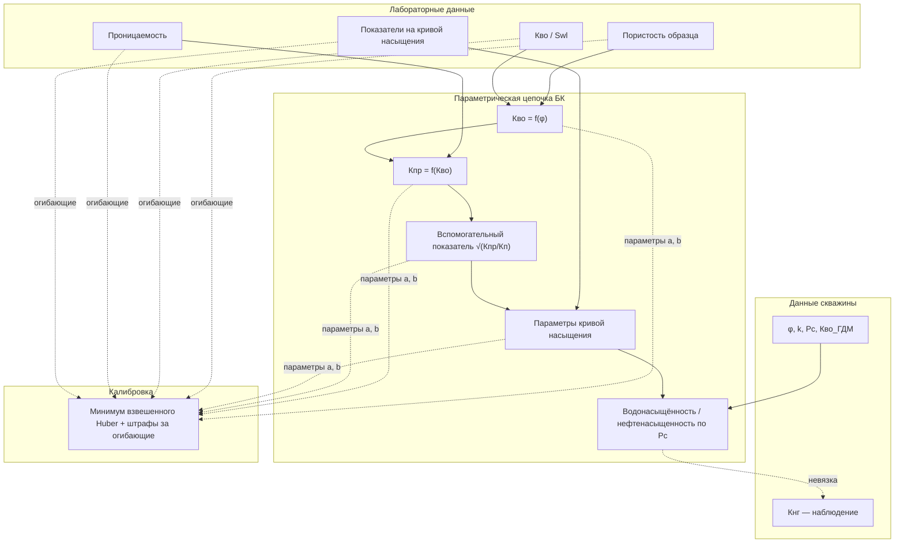

# Материалы к главе 1 ВКР: таблица и рисунок (для вставки в диссертацию)

**Полный текст главы 1** с уже вписанными отсылками к таблице 1.1 и рисунку 1.1: см. файл [`vkr_chapter1.md`](./vkr_chapter1.md).

Ниже — **Таблица 1.1** (обозначения) и **Рисунок 1.1** в виде диаграммы Mermaid (рендерится в GitHub, Typora, VS Code с расширением; для Word: экспорт PNG через [mermaid.live](https://mermaid.live) или вставка как рисунок).

---

## Таблица 1.1 — Условные обозначения и термины (фрагмент для главы 1)

**Таблица 1.1** — Основные обозначения и термины

| Обозначение / термин | Смысл в работе |
|----------------------|----------------|
| \(S_w\), Кво | Водонасыщённость; в данных скважины — величина, согласованная с колонкой SWL_GDM после нормализации |
| \(S_o\), \(K_{нг}\) | Нефтенасыщенность; в данных — показатель, согласованный с колонкой «Кнг» (историческое / модельное) |
| \(P_c\) | Капиллярное давление (входной атрибут скважинных данных) |
| \(\varphi\), \(k\) | Пористость и проницаемость (по данным ГДМ / геомодели) |
| J-функция Леверетта | Безразмерная характеристика капиллярного давления; в работе — параметрическая модель \(J \approx a \cdot S_{wn}^{b}\) для сопоставления с лабораторным облаком |
| Модель Брукса — Кори | В работе — **цепочка** зависимостей: Кво(пористость) → Кпр(Кво) → параметры на кривой насыщения; параметры \((a,b)\) по четырём звеньям |
| Огибающие | Верхняя и нижняя границы коридора по лабораторным точкам для каждого звена цепочки |
| Калибровка | Подбор численных параметров модели по минимуму целевого функционала при ограничениях |
| Вес точки | Коэффициент значимости наблюдения при суммировании невязки (в т.ч. учёт перфорации и добычи, если заданы) |
| Невязка | Разность «модель − наблюдение» по нефтенасыщенности (или эквивалентному показателю) в допустимых точках |

*Примечание.* Полный глоссарий при необходимости переносится в **приложение А**; в главе 1 достаточно фрагмента, не дублирующего Введение.

---

## Рисунок 1.1 — Обобщённая схема цепочки Брукса — Кори и связи с данными

**Рисунок 1.1** — Обобщённая структура расчёта нефтенасыщенности по цепочке Брукса — Кори и данным скважины

**Подпись к рисунку (вариант для текста главы):**  
*Рисунок 1.1* показывает, что лабораторные облака задают как **форму** зависимостей \(f\), так и **коридор** (огибающие), а данные скважины обеспечивают **условия среды** и **наблюдаемую** нефтенасыщенность для сопоставления с расчётом; блок калибровки объединяет параметры четырёх звеньев в единый вектор оптимизации.

---

## Рекомендуемые дополнительные иллюстрации (по главам)

### Глава 1 (теория)
- **Рисунок 1.2** — схема «капиллярное давление — J-функция — насыщенность» (блоки + стрелки).  
- **Рисунок 1.3** — пример **лабораторного облака** с нанесёнными нижней/верхней огибающими (лучше из **реальных** данных работы, с подписью осей).  
- **Таблица 1.2** — соответствие «входной столбец файла — физический смысл» (кратко, без дублирования приложения с форматами).

### Глава 2 (методика)
- **Рисунок 2.1** — блок-схема целевого функционала: Huber + штраф за огибающие + «барьер» при нарушении.  
- **Рисунок 2.2** — сравнение трёх оптимизаторов (DE / PSO / DA) как **алгоритмических** ветвей одной постановки (не обязательно графики сходимости — достаточно схемы).  
- **Таблица 2.1** — метрики качества (MAE, RMSE, bias, R², SCORE) и их интерпретация в одну страницу.

### Глава 3 (реализация)
- **Рисунок 3.1** — архитектура платформы (модули: данные → нормализация → оптимизация → визуализация → экспорт).  
- **Рисунок 3.2** — скриншот интерфейса (1–2 экрана с подписью элементов).  
- **Рисунок 3.3** — диаграмма последовательности (пользователь → вкладка → перерасчёт).

### Глава 4 (эксперимент)
- **Рисунки 4.1–4.3** — кроссплоты «модель — история», распределения, сравнение J и БК (из платформы).  
- **Таблица 4.1** — численные результаты по регионам / сценариям до и после смены оптимизатора.

---

## Оформление по ГОСТ (кратко)

1. Рисунки — сквозная нумерация по диссертации или по главе (как требует методичка).  
2. Подпись: слово **Рисунок** + номер + **название** (без точки в конце по многим шаблонам — уточнить у кафедры).  
3. Таблица: сверху **Таблица** + номер + название; при большом глоссарии — мелкий кегль или перенос в приложение.
