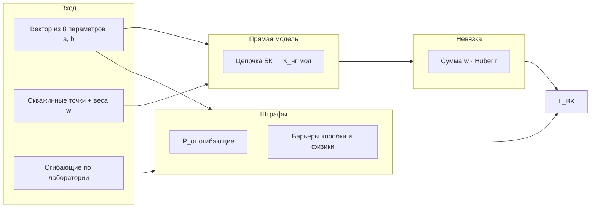

# Глава 2. Методика калибровки и оценки качества

**План главы.** В параграфе **2.1** описывается подготовка данных скважин и формирование весов наблюдений. В **2.2** формулируется целевая функция и ограничения для подбора параметров J-функции Леверетта. В **2.3** излагается целевая функция для цепочки Брукса — Кори с учётом огибающих по лабораторным облакам; структура функционала и штрафов иллюстрируется **рисунком 2.1**. В **2.4** рассматриваются алгоритмы глобальной оптимизации и их сопоставимость в одной постановке. В **2.5** задаются метрики интерпретации результатов и логика сравнения методов; перечень метрик сведён в **таблице 2.1**. В **выводах** формулируются положения, непосредственно используемые при программной реализации (глава 3) и при анализе экспериментов (глава 4).

---

## Таблица 2.1 — Метрики качества и назначение в работе

**Таблица 2.1** — Метрики качества согласования модели и данных

| Метрика (обозначение) | Смысл | Назначение в работе |
|----------------------|--------|---------------------|
| MAE | Среднее абсолютное отклонение | Базовая оценка величины ошибки по выборке |
| RMSE | Среднеквадратичное отклонение | Чувствительность к крупным невязкам |
| BIAS | Систематическое смещение (средняя невязка) | Выявление завышения/занижения модели |
| \(R^2\) | Коэффициент детерминации | Оценка доли объяснённой дисперсии (при линейно-согласуемых рядах) |
| SCORE | Интегральный показатель согласования (агрегат по невязкам с весами) | Сводная оценка качества по региону для сопоставления сценариев |

*Примечание.* Конкретные формулы расчёта метрик в программной реализации соответствуют принятой в коде агрегации по региону \(PVTNUM\) и весам наблюдений; при необходимости они приводятся в приложении или в главе 4 как часть описания эксперимента.

---

## 2.1. Подготовка данных и веса наблюдений

Исходные таблицы скважин и (опционально) добычи проходят этап **нормализации имён столбцов** и сопоставления полей с внутренней моделью данных платформы. Для скважин фиксируется набор обязательных атрибутов (скважина, регион, пористость, проницаемость, капиллярное давление, водонасыщённость, нефтенасыщенность и др. в соответствии с таблицей 1.1 главы 1).

**Веса** \(w_i\) назначаются каждой точке (или группе точек) и используются при суммировании функции потерь. В реализации платформы предусмотрено:  
**(а)** удвоение веса для интервалов с признаком перфорации (если колонка доступна и опция включена);  
**(б)** модификация весов по данным добычи (ранжирование скважин по накопленной добыче нефти в регионе с нормировкой коэффициента).  

Таким образом, методика отражает прикладной принцип: **не все наблюдения равнозначны** при калибровке. Пустые или некорректные значения исключаются из суммирования на этапе вычисления невязки.

---

## 2.2. Целевая функция и ограничения для J-функции Леверетта

Параметры модели Леверетта в работе задаются тройкой \((a, b, \sigma)\) в рамках **коробочных ограничений** по каждому региону \(PVTNUM\): для каждого коэффициента задаются нижняя и верхняя границы (вручную, из файла ограничений или по автоматическому оцениванию границ по лабораторному облаку точек).

**Целевая функция** на подмножестве точек региона имеет вид взвешенной суммы **функций потерь Хьюбера** по невязке между расчётной и наблюдаемой нефтенасыщенностью:

\[
\mathcal{L}_{J} = \sum_i w_i \cdot \rho_{\delta}(r_i), \qquad r_i = K^{мод}_{нг,i} - K^{наб}_{нг,i},
\]

где \(\rho_{\delta}\) — функция Хьюбера с порогом \(\delta\) (в реализации принято фиксированное значение порога для устойчивости к выбросам): при малых \(|r_i|\) используется квадратичный штраф, при больших — линейный рост, что снижает влияние единичных аномальных точек по сравнению с чисто квадратичной невязкой.

**Задача оптимизации** — найти \(\arg\min \mathcal{L}_{J}\) на декартовом произведении допустимых интервалов по \((a,b,\sigma)\). Учёт весов и робастной функции согласуется с постановкой главы 1 (п. 1.5).

---

## 2.3. Целевая функция и ограничения для модели Брукса — Кори

Вектор подбираемых параметров цепочки Брукса — Кори в работе имеет размерность **восемь**: по два параметра \((a, b)\) для четырёх звеньев (связь Кво с пористостью в экспоненциальной форме; три степенные зависимости для проницаемости, параметров на кривой насыщения и т.д. — в соответствии с главой 1 и рисунком 1.1). Дополнительно фиксируется верхняя граница проницаемости (мД) как параметр сценария расчёта, не входящий в вектор глобальной оптимизации в базовой постановке.

**Невязка по скважинным точкам** формируется аналогично п. 2.2: взвешенная сумма функций Хьюбера по разности «модель − наблюдение» по нефтенасыщенности после прохождения параметров через прямую модель «цепочка БК → \(K_{нг}\)».

**Огибающие по лаборатории** вводят аддитивный штраф \(\mathcal{P}_{ог}\). Для каждого из четырёх звеньев на сетке лабораторных абсцисс вычисляется отклонение оптимальной кривой от коридора между нижней и верхней огибающими. При **значительном выходе** за коридор (жёсткий барьер в реализации) функционал принимает большое значение, фактически исключая недопустимую точку из области поиска; при **умеренных** нарушениях действует штрафная составляющая, пропорциональная среднему нарушению.

Итоговый функционал:

\[
\mathcal{L}_{БК} = \sum_i w_i \cdot \rho_{\delta}(r_i) + \mathcal{P}_{ог}.
\]

Дополнительно вводятся **априорные барьеры** на параметры (положительность множителей \(a\) для степенных ветвей, отрицательность показателей \(b\) и ограничения на \(a_{swl}, b_{swl}\) в физически допустимых пределах): при нарушении возвращается большое константное значение функционала.

**Структура вычисления** \(\mathcal{L}_{БК}\) (невязка + огибающие + барьеры) представлена на **рисунке 2.1**.

**Рисунок 2.1** — Структура целевого функционала калибровки модели Брукса — Кори

После минимизации \(\mathcal{L}_{БК}\) в программной реализации выполняется **сравнение** полученного решения с альтернативными наборами параметров (корреляционное приближение по лаборатории, базовый набор) и выбор варианта по **интегральной метрике согласования** наблюдений (см. п. 2.5), что согласует устойчивость оптимизации с требованиями интерпретации для пользователя.

---

## 2.4. Алгоритмы глобальной оптимизации

Для обеих методических линий (J и БК) используется **один тип постановки**: минимизация функционала на коробке параметров с обращением к процедурам **глобального** поиска. В работе реализованы и сопоставимы три алгоритма:

1. **Дифференциальная эволюция (DE)** — популяционный метод; для БК используется инициализация популяции в окрестности корреляционного приближения по лабораторным облакам.  
2. **Рой частиц (PSO)** — стохастическая траектория частиц с коррекцией скорости; границы соблюдаются проекцией на коробку после каждого шага.  
3. **Dual Annealing** — глобальный стохастический метод с механизмом, родственным имитации отжига; результат проецируется на допустимую коробку.

**Общие принципы методики:** один и тот же функционал \(\mathcal{L}\) и одни и те же границы для всех трёх алгоритмов; различие — в стратегии обхода ландшафта. Это обеспечивает **сопоставимость** результатов при смене оптимизатора (анализ в главе 4). Число итераций и размер популяции (для DE и PSO) задаются пользователем как параметры вычислительного эксперимента.

---

## 2.5. Метрики интерпретации и сравнение методов

Для оценки качества после подбора параметров используется набор метрик по регионам и точкам (**таблица 2.1**). Они дополняют, но **не дублируют** целевую функцию оптимизации: например, интегральный **SCORE** может опираться на взвешенную среднюю абсолютную ошибку и отражать «удобство» сравнения сценариев для пользователя, тогда как при обучении используется робастная функция Хьюбера.

**Сравнение J и БК** в методическом плане включает:  
**(а)** согласование на общих скважинах и глубинных отметках (или их дискретизации) при построении сопоставимых выборок;  
**(б)** визуальные приёмы (кроссплоты «модель — история», распределения, профили);  
**(в)** количественные метрики по таблице 2.1 и агрегированные показатели по регионам.

Методика сравнения опирается на сохранение **снимков** результатов (фиксация набора точек и параметров для последующего раздела «Сравнение методов» в платформе), что обеспечивает воспроизводимость эксперимента главы 4.

---

## Выводы по главе 2

1. Сформулирована **единая схема** подготовки данных и весов, используемая для обеих капиллярных постановок.  
2. Для J-функции Леверетта заданы **коробочные ограничения** и целевой функционал \(\mathcal{L}_{J}\) на основе взвешенной функции Хьюбера.  
3. Для модели Брукса — Кори задан функционал \(\mathcal{L}_{БК}\) как сумма взвешенной робастной невязки и **штрафа за огибающие** с жёстким барьером при существенном нарушении коридора (**рисунок 2.1**).  
4. Обеспечена **сопоставимость** трёх алгоритмов глобальной оптимизации при неизменных функционале и ограничениях.  
5. Введён **набор метрик интерпретации** (**таблица 2.1**) и логика сравнения методов, используемые в главе 3 (реализация) и главе 4 (эксперимент).

---

*Рисунок 2.1: для Word экспортировать Mermaid через [mermaid.live](https://mermaid.live). Связь с главой 1: термины таблицы 1.1; переход к главе 3: модульная реализация описанных процедур.*
