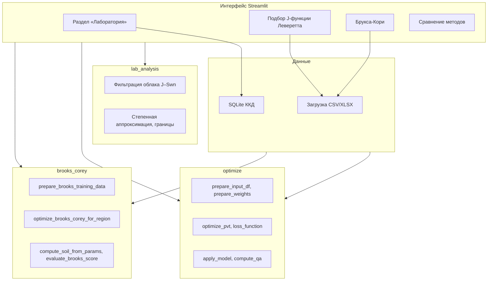

# Глава 3. Программная реализация платформы

**План главы.** В параграфе **3.1** обосновывается выбор технологий и общая архитектура решения; структура компонентов приведена на **рисунке 3.1**. В **3.2** описывается слой данных: загрузка файлов, нормализация полей, обязательные атрибуты скважин и вспомогательные источники (лабораторная БД ККД). В **3.3** раскрывается реализация вычислительных процедур для J-функции Леверетта и цепочки Брукса — Кори в модулях `optimize` и `brooks_corey`. В **3.4** излагается пользовательский интерфейс на базе Streamlit и разбиение на функциональные разделы. В **3.5** рассматриваются визуализация результатов, метрики контроля качества и механизм **снимков** для сравнения методов. Перечень ключевых технологий сведён в **таблице 3.1**. В **выводах** формулируются положения, связывающие реализацию с методикой главы 2 и подготавливающие материал для главы 4.

---

## Таблица 3.1 — Программный стек и назначение компонентов

**Таблица 3.1** — Основные технологии платформы

| Компонент | Назначение в работе |
|-----------|---------------------|
| Python 3 | Язык реализации бизнес-логики и интерфейса |
| Streamlit | Веб-интерфейс одностраничного типа, формы, перерисовка сценариев |
| pandas / NumPy | Табличное представление данных скважин и добычи, векторные расчёты |
| SciPy (`differential_evolution`, `dual_annealing`) | Глобальная минимизация целевых функционалов |
| scikit-learn (`r2_score`) | Расчёт коэффициента детерминации в метриках по региону |
| Plotly | Интерактивные графики (облака точек, профили, гистограммы сравнения) |
| SQLite (`kkd_database`) | Локальное хранение нормализованной лабораторной таблицы ККД после импорта из Excel |

*Примечание.* Версии интерпретатора и библиотек фиксируются файлом зависимостей проекта (при наличии) или перечисляются в приложении к ВКР.

---

## 3.1. Архитектура и принципы построения ПО

Платформа реализована как **монолитное приложение** с выделенными Python-модулями предметной области и **единой точкой входа** — сценарием Streamlit (`streamlit_app.py`). Такой подход сочетает низкую операционную сложность развёртывания (достаточно среды Python и команды запуска Streamlit) с **чётким разделением ответственности**: интерфейс отвечает за ввод данных и отображение, а численные процедуры калибровки сосредоточены в модулях `optimize` и `brooks_corey`, что соответствует методике главы 2.

**Рисунок 3.1** — Логическая структура платформы

**Принципы реализации:** использование **типизированных** сигнатур функций (в т.ч. `typing`, `dataclass` для структур вроде `PowerBounds`); кэширование тяжёлых операций чтения (`st.cache_data`) для ускорения повторных прогонов; явная валидация обязательных столбцов перед запуском конвейера J-модели.

---

## 3.2. Слой данных и подготовка входных таблиц

**Загрузка файлов.** Пользователь передаёт таблицы скважин (и при необходимости добычи) через виджеты загрузки; допускаются форматы CSV и Excel. Для устойчивости к различным экспортам ГДМ выполняется **нормализация имён столбцов** и приведение числовых полей к единому виду (в т.ч. пористость в долях, нефтенасыщенность в интервале \([0,1]\) при значениях в процентах).

**Обязательный набор для ветви Леверетта** задаётся константой `REQUIRED_WELL_COLUMNS` в модуле `optimize`: идентификатор скважины, регион `PVTNUM_GDM`, пористость и проницаемость по геомодели, капиллярное давление `PC`, водонасыщённость `SWL_GDM`, целевой показатель `Кнг_W`. Отсутствие любого из столбцов приводит к **явному сообщении об ошибке** до начала оптимизации.

**Функция `prepare_input_df`** отфильтровывает строки с неполными числовыми атрибутами, формирует вспомогательное поле `PORO_FRAC` и при наличии колонки активности оставляет активные ячейки (`ACTNUM_GDM == 1`), что согласуется с прикладной трактовкой «рабочих» точек геомодели.

**Веса наблюдений** формируются в `prepare_weights`: базовый вес 1, удвоение для интервалов с признаком перфорации (`Perf_GDM`), масштабирование по рангу накопленной добычи нефти в регионе при наличии согласованных столбцов файла добычи (см. главу 2).

**Обучающая выборка для J.** Перед оптимизацией применяется `_filter_training_kng`: исключаются нулевые значения целевой нефтенасыщенности и выбросы по правилу квартилей (с запасным варианту по квантилям 2/98), чтобы стабилизировать ландшафт целевой функции; полный датафрейм сохраняется для визуализации.

**Лабораторные данные ККД.** Модуль `kkd_database` обеспечивает однократную **сборку** таблицы из Excel в локальный файл SQLite и последующую **выборку** в `pandas.DataFrame` для раздела «Лаборатория» и для построения огибающих в ветви Брукса — Кори. Нормализация заголовков при импорте снижает риск расхождений имён полей между версиями исходного файла.

---

## 3.3. Реализация калибровки J-функции и модели Брукса — Кори

**Ветвь Леверетта (`optimize`).** Целевая функция `loss_function` вычисляет взвешенную сумму функций Хьюбера (`huber_loss` с фиксированным порогом \(\delta\)) по невязке «модельная − наблюдаемая» нефтенасыщенность; модельная компонента получается векторно в `calc_kng_vector` через безразмерную группу \(J\) и степенную зависимость от нормированной водонасыщённости. Подбор по каждому региону выполняется в `optimize_pvt` одним из трёх методов: `differential_evolution`, `dual_annealing` или собственная реализация **PSO** (`_pso_optimize`) с проекцией на коробку и тем же функционалом потерь. Результат конвейера `run_pipeline` — три таблицы: расширенный датафрейм с колонкой `Kng_model`, таблица подобранных параметров \((a,b,\sigma)\) по `PVTNUM_GDM`, таблица метрик `MAE`, `RMSE`, `BIAS`, `R2`, `SCORE` по регионам (`compute_qa`).

**Ветвь Брукса — Кори (`brooks_corey`).** Прямая модель `compute_soil_from_params` реализует цепочку зависимостей главы 1: от пористости к водонасыщённости, далее к проницаемости и параметрам на кривой насыщения с ограничением сверху по проницаемости (`DEFAULT_PERM_MAX_MD`). Автоматические коридоры по лабораторным облакам задаются функциями `auto_exp_bounds_swl_poro` и `auto_power_bounds`; штраф за выход за огибающие и жёсткий барьер реализованы в логике оптимизации совместно с `envelope_max_violation`. Глобальный поиск — снова **DE / dual annealing / PSO** (`_bc_pso_optimize`) на векторе из восьми параметров с инициализацией популяции DE в окрестности корреляционного приближения. Для отбора сценария после минимизации используется отдельная метрика `evaluate_brooks_score` (взвешенная \(L_1\)-подобная невязка), что разводит **критерий оптимизации** и **критерий отчётности**, как отмечено в главе 2.

**Общие зависимости.** Модуль `brooks_corey` переиспользует `huber_loss`, `prepare_input_df` и `prepare_weights` из `optimize`, что исключает дублирование кода весов и робастной невязки.

---

## 3.4. Пользовательский интерфейс и сценарии работы

Интерфейс построен на **боковой панели** выбора раздела и основной области контента. Реализованы четыре раздела (соответствуют узлам на **рисунке 3.1**):

1. **«Лаборатория»** — загрузка или выбор лабораторной таблицы, эвристический выбор столбцов площади, горизонта, \(S_{wn}\), \(J\), фильтрация облака (`filter_lab_df`), подгонка степенной модели `fit_power_j_swn`, визуализация и опциональная передача оценённых границ в раздел Леверетта (`auto_ab_bounds_from_cloud`).

2. **«Подбор J функции Леверетта»** — загрузка скважин и добычи, сопоставление столцов при нетипичных именах, выбор оптимизатора и числа итераций в боковой панели, режимы задания границ (вручную, из файла, по лабораторному облаку), запуск `run_pipeline`, таблицы параметров и QA, графики по регионам и скважинам.

3. **«Брукса-Кори»** — аналогичная схема для восьмипараметрической модели: выбор источника лабораторных точек (загрузка или ККД из SQLite), настройка оптимизатора, предпросмотр кривых и коридоров, расчёт по регионам и визуализация.

4. **«Сравнение методов»** — выбор сохранённых **снимков** J и БК, сопоставление метрик, кроссплоты, гистограммы распределений модельной нефтенасыщенности, детальный профиль по скважине.

Для длительных операций используется **блокировка интерфейса** (`_ui_lock`) и вспомогательная прокрутка к началу страницы после перезапуска сценария, что улучшает восприятие длительных расчётов.

---

## 3.5. Визуализация, контроль качества и снимки результатов

**Визуализация** выполняется средствами Plotly: облака «история — модель», цветовая кодировка по весу или толщине пласта, лабораторные кривые с огибающими для БК. Это обеспечивает интерактивный анализ без отдельного клиентского приложения.

**Метрики** для табличного вывода согласованы с главой 2 и реализованы в `compute_qa` (ветвь J); для БК формируются аналогичные показатели по регионам в логике интерфейса после расчёта.

**Снимки** (`_build_well_snapshot`, `_save_well_snapshot`, каталог `_snapshot_catalog`) сохраняют зафиксированный набор точек и признак метода в каталоге данных приложения, что позволяет в разделе сравнения воспроизводить **одинаковую геометрию выборки** для J и БК и тем самым выполнять требование сопоставимости эксперимента главы 4.

**Экспорт** результатов в CSV (в т.ч. с округлением числовых столбцов) поддерживается для передачи таблиц в отчёт или внешние средства.

---

## Выводы по главе 3

1. Выбран и обоснован **стек технологий** (**таблица 3.1**), обеспечивающий воспроизводимость расчётов и наглядность интерфейса.  
2. Реализован **слой данных** с нормализацией, валидацией обязательных полей и раздельной подготовкой обучающей выборки для оптимизации J.  
3. Модули **`optimize`** и **`brooks_corey`** воплощают методику главы 2: робастная невязка, три глобальных оптимизатора, для БК — огибающие и отдельная метрика отбора.  
4. Интерфейс Streamlit разбит на **четыре согласованных сценария**, покрывающих лабораторный анализ, обе калибровки и сравнение (**рисунок 3.1**).  
5. Предусмотрены механизмы **снимков и сравнения**, задающие основу для количественного и визуального анализа в главе 4.

---

*Рисунок 3.1: для Word — экспорт Mermaid через [mermaid.live](https://mermaid.live). Связь с главой 2: соответствие функционалов \(\mathcal{L}_{J}\), \(\mathcal{L}_{БК}\) и метрик; переход к главе 4: описание вычислительных экспериментов и интерпретация полученных оценок.*
