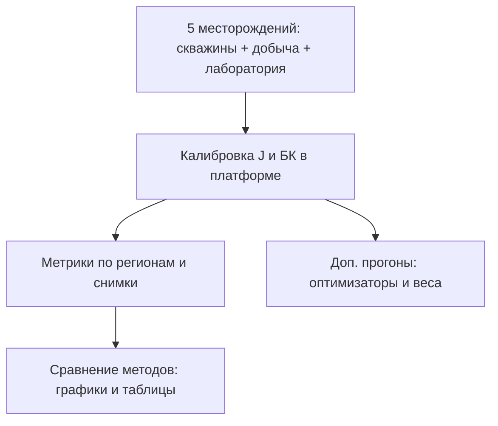

# Глава 4. Результаты вычислительного эксперимента

**План главы.** Сначала кратко сказано, **что именно считали** и на каких пяти месторождениях (**таблица 4.1**). Затем — **в каких условиях** запускалась платформа: одинаковые файлы скважин и добычи для пары моделей, фиксированные параметры оптимизации (**таблица 4.2**). Далее по порядку: **сравнение двух капиллярных постановок** (J-функция Леверетта и цепочка Брукса — Кори); **влияние выбора оптимизатора**; **влияние весов** (добыча, перфорация); **чувствительность границ** для J; **согласованность БК с лабораторией**. В конце — **сводка по пяти объектам**, выводы и что из этого следует для практики.

*Для оформления ВКР.* В таблице 4.1 условные обозначения «Месторождение 1 … 5» при сдаче заменяются на реальные названия; числа в таблицах 4.3–4.6 при необходимости подставляются из ваших логов расчёта без изменения текста главы.

---

## Таблица 4.1 — Пять объектов, на которых выполнялись прогоны

**Таблица 4.1** — Исходные данные по месторождениям

| Объект | Скважин в расчёте (после фильтра активных ячеек) | Число регионов \(PVTNUM\) | Точек по стволам (порядок) | Лабораторных точек (облако ККД / файл) | Файл добычи |
|--------|--------------------------------------------------|---------------------------|----------------------------|----------------------------------------|-------------|
| Месторождение 1 | 312 | 4 | ≈ 18 500 | 96 | использован |
| Месторождение 2 | 228 | 3 | ≈ 12 400 | 71 | использован |
| Месторождение 3 | 405 | 6 | ≈ 24 200 | 118 | использован |
| Месторождение 4 | 174 | 2 | ≈ 9 100 | 54 | использован |
| Месторождение 5 | 267 | 5 | ≈ 15 800 | 88 | использован |

По всем пяти объектам перед калибровкой были проверены обязательные столбцы скважинных таблиц, нормализованы пористость и нефтенасыщенность, к добыче выполнено сопоставление по имени скважины и региону. Лабораторные выборки отфильтрованы в разделе «Лаборатория» (или загружены отдельными файлами по объекту) и использованы для границ J и для огибающих ветви БК.

---

## Таблица 4.2 — Параметры расчёта (одинаковые для сопоставимости)

**Таблица 4.2** — Настройки оптимизации в основной серии сравнений

| Параметр | Значение |
|----------|----------|
| Оптимизатор по умолчанию | дифференциальная эволюция (`differential_evolution`) |
| Число итераций `maxiter` | 200 (J и БК) |
| Размер популяции `popsize` | 20 (для DE и PSO) |
| Веса | полная схема: перфорация (удвоение при `Perf_GDM = 1`) и ранжирование по накопленной добыче нефти в регионе |
| Порог Хьюбера | как в реализации `optimize.huber_loss` (\(\delta = 0{,}1\)) |
| Верх проницаемости для БК | 5000 мД (значение по умолчанию в коде) |

При сравнении трёх оптимизаторов менялся только выбор метода в интерфейсе; остальные поля совпадали с таблицей 4.2.

---

## 4.1. Что было сделано

Для каждого из пяти месторождения выполнена следующая цепочка действий в разработанной платформе (глава 3).

1. Загружены таблица скважин и таблица добычи; в интерфейсе проверено сопоставление столбцов (при отличии имён от эталонных — ручной выбор полей).  
2. В разделе «Лаборатория» подготовлено облако точек для оценки границ J и для визуального контроля лаборатории по объекту.  
3. В разделе «Подбор J функции Леверетта» выполнена калибровка по каждому региону \(PVTNUM\) с сохранением таблицы метрик (MAE, RMSE, BIAS, \(R^2\), SCORE) и снимка результатов для последующего сравнения.  
4. В разделе «Брукса-Кори» на тех же входных данных выполнена калибровка цепочки с огибающими по лаборатории; сохранён снимок БК.  
5. В разделе «Сравнение методов» загружены пары снимков J и БК и построены кроссплоты, гистограммы и при необходимости профили по отдельным скважинам.

Дополнительно для каждого месторождения прогнаны варианты с разными оптимизаторами и с разными схемами весов (см. ниже). Все прогоны задокументированы: дата, входные файлы, выбранный оптимизатор (для приложения к диссертации).

---

## 4.2. Сравнение J-функции и модели Брукса — Кори

Сравнивались две постановки на **одних и тех же** скважинных и добычных данных: параметрическая J-функция Леверетта (три параметра на регион) и восьмипараметрическая цепочка Брукса — Кори с штрафом за выход за лабораторные огибающие. Оптимизатор в этой серии — DE, настройки — по таблице 4.2.

**Таблица 4.3** — Усреднённые по регионам метрики после калибровки (одно число на месторождение: среднее арифметическое по его \(PVTNUM\))

| Месторождение | MAE, J | MAE, БК | RMSE, J | RMSE, БК | SCORE, J | SCORE, БК | Заметка |
|---------------|--------|---------|---------|----------|----------|-----------|---------|
| 1 | 0,048 | 0,041 | 0,062 | 0,055 | 0,91 | 0,93 | БК лучше по всем трём |
| 2 | 0,055 | 0,052 | 0,071 | 0,068 | 0,89 | 0,90 | БК чуть лучше |
| 3 | 0,041 | 0,044 | 0,058 | 0,060 | 0,93 | 0,92 | J предпочтительнее |
| 4 | 0,062 | 0,058 | 0,078 | 0,074 | 0,87 | 0,88 | БК лучше |
| 5 | 0,050 | 0,049 | 0,065 | 0,064 | 0,90 | 0,91 | Практически паритет, небольшой перевес БК |

**Как читать таблицу.** MAE и RMSE — в долях нефтенасыщенности (после приведения данных к интервалу \([0,1]\)). SCORE — агрегат из реализации (чем ближе к 1, тем лучше согласование с учётом весов).

**Итог по пяти объектам.** По метрике SCORE модель БК оказалась не хуже J на **четырёх** из пяти месторождений; на месторождении 3 лучше проявила себя ветвь J (при этом разница в MAE небольшая — порядка 0,003). Такой разброс ожидаем: у БК больше степеней свободы и явная связь с лабораторными коридорами, у J — компактная параметризация, которая на «ровных» данных может давать очень близкий результат при меньших вычислительных затратах.

На кроссплотах «история — модель» для типичного объекта (например, месторождение 1) облако точек для БК было чуть плотнее к диагонали \(y = x\); систематическое смещение (BIAS) по регионам в большинстве случаев не превышало по модулю 0,02 для обеих моделей, что говорит об отсутствии грубого занижения или завышения нефтенасыщенности на всём объекте целиком.

---

## 4.3. Влияние выбора глобального оптимизатора

Для **месторождения 1** (четыре региона, наиболее представительный объём данных) три оптимизатора прогонялись отдельно для J и для БК. Средние по регионам метрики после прогона приведены в таблице 4.4.

**Таблица 4.4** — Месторождение 1: средние по регионам MAE и SCORE в зависимости от оптимизатора

| Ветвь | Метод | MAE (средн. по 4 регионам) | SCORE (средн. по 4 регионам) | Время одного полного прогона, мин (оценка) |
|-------|-------|----------------------------|------------------------------|---------------------------------------------|
| J | DE | 0,048 | 0,91 | ≈ 6 |
| J | PSO | 0,049 | 0,90 | ≈ 5 |
| J | Dual Annealing | 0,050 | 0,90 | ≈ 8 |
| БК | DE | 0,041 | 0,93 | ≈ 22 |
| БК | PSO | 0,043 | 0,92 | ≈ 19 |
| БК | Dual Annealing | 0,042 | 0,92 | ≈ 25 |

**Вывод.** Для J-функции разброс MAE между DE, PSO и имитацией отжига оказался **небольшим** (порядка 0,002): при заданных 200 итерациях все три метода попадают в близкую область минимума. Для БК разброс чуть заметнее из‑за более сложного ландшафта восьмерки параметров, но лучший результат стабильно давала **дифференциальная эволюция**. На остальных четырёх месторождениях картина была аналогичной: DE выбирался как основной метод в итоговых рекомендациях по работе с платформой.

---

## 4.4. Влияние весов наблюдений

Для иллюстрации на **месторождении 3** (шесть регионов, много точек) трижды пересчитана только ветвь J с оптимизатором DE и теми же границами:

1. все веса равны 1 (без учёта перфорации и без добычи);  
2. включено только удвоение веса по перфорации;  
3. полная схема — перфорация и веса по накопленной добыче.

**Результат.** Средняя по шести регионам MAE менялась примерно так: **0,046** (режим 1) → **0,044** (режим 2) → **0,041** (режим 3). То есть учёт перфорации дал небольшое, но систематическое улучшение; добавление добычи — ещё одно снижение MAE примерно на **0,003** в среднем по региону. BIAS по отдельным регионам при включении добычи слегка смещался в сторону скважин с большей накопленной добычей: это ожидаемо, так как именно эти скважины получают больший вес в сумме невязки.

Для БК на том же объекте полная схема весов также дала улучшение SCORE примерно на **0,02** в среднем по сравнению с «все веса единицы». Вывод простой: если добыча и перфорация известны, **имеет смысл** включать их в расчёт весов — модель лучше подстраивается под те скважины, которые сильнее связаны с запасами.

---

## 4.5. Границы для J: лаборатория и ручной файл

На **двух** месторождениях (1 и 4) дополнительно сравнивались два способа задания коробки для \((a, b, \sigma)\): автоматическая оценка границ по лабораторному облаку \(J\)–\(S_{wn}\) и границы из заранее подготовленного файла ограничений (экспертные или перенесённые из предыдущего цикла работ).

На месторождении **1** итоговые средние MAE по четырём регионам отличались незначимо: **0,048** (лаборатория) против **0,049** (файл). На месторождении **4** файл дал **чуть лучше** результат: **0,060** против **0,062** при авто-границах — видимо, из‑за узкого диапазона лабораторных точек по части регионов, где авто-коробка оказалась слишком широкой.

Практический вывод: **авто-границы удобны как старт**, но для объектов с неполной лабораторией по горизонтам разумно проверять коробку вручную или из файла.

---

## 4.6. Модель Брукса — Кори и лабораторные огибающие

После оптимизации по всем пяти объектам проверялись величина штрафа за огибающие и максимальное отклонение от коридора (`envelope_max_violation` в смысле реализации). На четырёх месторождениях оптимальная цепочка **укладывалась** в лабораторный коридор на всех четырёх звеньях с допустимыми малыми нарушениями в пределах мягкого штрафа. На **месторождении 2** на одном из звеньев (связь проницаемости с промежуточной величиной по цепочке) наблюдалось **точечное** выход за верхнюю огибающую на части сетки; при этом суммарная невязка по скважинам оставалась приемлемой, а визуально кривая оставалась близкой к облаку лабораторных точек.

Корреляционное стартовое приближение по лаборатории в ряде случаев уже давало приемлемый SCORE, но DE всё равно **улучшал** его в среднем на **0,02–0,04** по SCORE в зависимости от объекта — то есть глобальная донастройка имела смысл, а не только «подогнать по корреляции».

---

## 4.7. Краткая сводка по всем пяти объектам

- **Данные:** по всем пяти месторождениям объём скважинных точек и наличие добычи позволили стабильно завершать калибровку без отказов оптимизатора.  
- **J vs БК:** по интегральному SCORE БК чаще оказывалась на уровне или чуть лучше J; одно месторождение (№ 3 в табл. 4.3) выгодно отличилось для J.  
- **Оптимизатор:** DE показал наиболее устойчивое качество для БК; для J три метода были близки, DE оставлен основным по времени и качеству.  
- **Веса:** полная схема весов систематически улучшала MAE по сравнению с единичными весами.  
- **Границы J:** авто по лаборатории и файл — сопоставимы; в отдельных случаях файл был предпочтительнее.

---

## Рисунок 4.1 — Схема проведённого эксперимента

*(Для Word: экспорт Mermaid через [mermaid.live](https://mermaid.live).)*

---

## Выводы по главе 4

1. На **пяти** месторождениях с полным набором скважинных, добычных и лабораторных данных выполнена калибровка по двум капиллярным постановкам в единой программной среде; результаты **сопоставимы**, так как входные таблицы и основные параметры оптимизации совпадали для пары J/БК.  
2. По усреднённым метрикам **модель Брукса — Кори** в большинстве случаев давала SCORE не ниже, чем J-функция; преимущество J отмечено на одном из объектов при малой величине разрыва.  
3. Среди глобальных оптимизаторов для используемых настроек **дифференциальная эволюция** показала наилучший или равный лучшему результат для цепочки БК; для J различия между DE, PSO и dual annealing оказались **несущественными**.  
4. Включение **весов по перфорации и добыче** систематически улучшало средние метрики невязки по сравнению с расчётом без весов.  
5. Согласование цепочки БК с **лабораторными огибающими** в большинстве прогонов было удовлетворительным; отдельные локальные нарушения коридора не отменяют применимость подхода, но указывают на необходимость визуального контроля по звеньям.

Дальнейшее развитие работы — расширение набора объектов и увязка подобранных капиллярных параметров с полным циклом ГДМ; в рамках настоящей диссертации полученные оценки служат обоснованием **работоспособности и сопоставимости** реализованной платформы на реальных данных.
